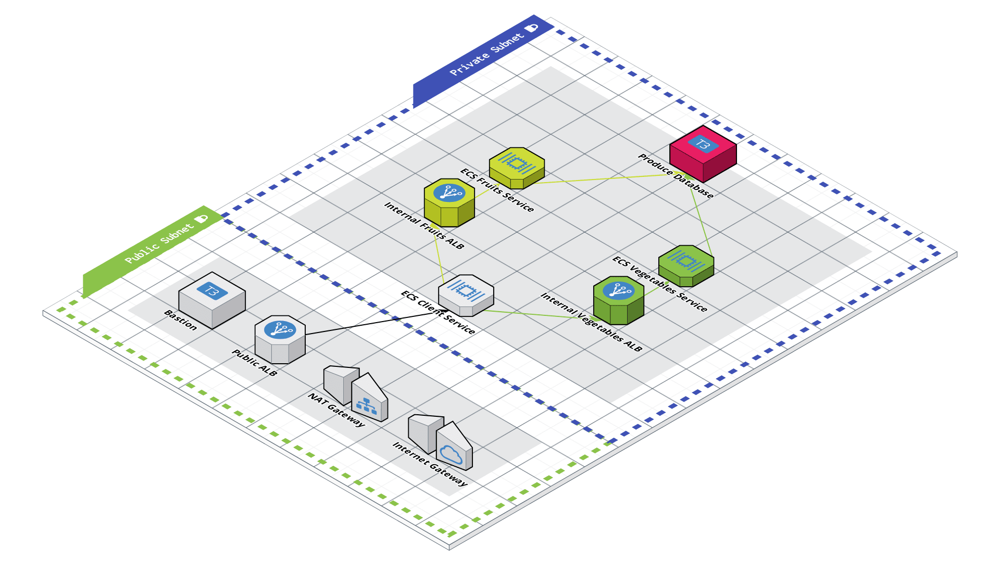

# Microservices Architecture on AWS

This is the working github repository for the [**"Learning Live with AWS & HashiCorp"**](https://www.youtube.com/playlist?list=PL81sUbsFNc5bYnjraNpivm1XxR3WNM_Kd) series. We'll discuss the foundations of a microservices architecture, the problem space it solves, where service mesh fits into all of this, and then begin from scratch - setting up a Terraform project, creating a Virtual Private Cloud (VPC), and explaining all of the concepts along the way.

This repo will be updated after each episode!

This repo is split into branches, each representing a part in the series:

- [Part 1](https://github.com/hashicorp/microservices-architecture-on-aws/tree/part-1) - Setting up the Terraform project and creating a VPC
- [Part 2](https://github.com/hashicorp/microservices-architecture-on-aws/tree/part-2) - Creating your first containerized microservice on Amazon ECS with Terraform
- [Part 3](https://github.com/hashicorp/microservices-architecture-on-aws/tree/part-3) - Extending your application with private microservices
- [Part 4](https://github.com/hashicorp/microservices-architecture-on-aws/tree/part-4) - Introducing a Service Mesh with Consul
- [Part 5](https://github.com/hashicorp/microservices-architecture-on-aws/tree/part-5) - Setting Up Your Service Mesh Servers
- [Part 6](https://github.com/hashicorp/microservices-architecture-on-aws/tree/part-6) - Connecting Amazon ECS Services to Consul Servers

## The Architecture

Our first section of episodes will work towards building out the following architecture:

The second section of episodes will work towards refactoring the first section's architecture into using a Service Mesh.

## Getting Started

#### Prerequisites

1. Have an [AWS Account](https://aws.amazon.com/).

2. Install [HashiCorp Terraform](https://www.terraform.io/downloads).

3. Have the [AWS CLI Installed](https://docs.aws.amazon.com/cli/latest/userguide/getting-started-install.html).

4. Create an [AWS IAM User](https://docs.aws.amazon.com/IAM/latest/UserGuide/getting-started_create-admin-group.html) with Admin or Power User Permissions.
  - this user will only be used locally

5. [Configure the AWS CLI](https://docs.aws.amazon.com/cli/latest/userguide/cli-chap-configure.html) with the IAM User from Step 4.
  - Terraform will read your credentials via the AWS CLI 
  - [Other Authentication Methods with AWS and Terraform](https://registry.terraform.io/providers/hashicorp/aws/latest/docs#authentication)

#### Using this Code

1. Clone this repo to an empty directory.

2. Run `terraform plan` to see what resources will be created.

3. Run `terraform apply` to create the infrastructure on AWS!

4. Open your Consul Server's Load Balancer (output as `consul_server_endpoint`).

5. Run `bash scripts/post-apply.sh` and follow the instructions OR open your terraform statefile and copy your Consul Bootstrap Token.  Use this to Login to the Consul UI.
  - It may take a few moments for all of the services to come on line.

6. Click on **Services** in the side navigation.

7. Select our "Client" service and then click on the **Topology** tab.

8. Find the red arrow lines between the client service and the fruits / vegetables services.  Click on one of the red arrows to reveal a dialogue box that will ask if you'd like to create an intention.  Click **Create**.

9. Navigate to your Client Application Load Balancer (output as `client_alb_dns`) to confirm that everything is working.
  - It may take a few moments for the new intentions to be recognized.

10. Run `terraform destroy` when you're done to get rid of the infrastructure.

## Questions?  Suggestions?  Comments?

Reach out to either [Jenna Pederson](https://twitter.com/jennapederson) or [J. Cole Morrison](https://twitter.com/JColeMorrison).  Also, feel free to leave any issues you run into on this Github Repo!