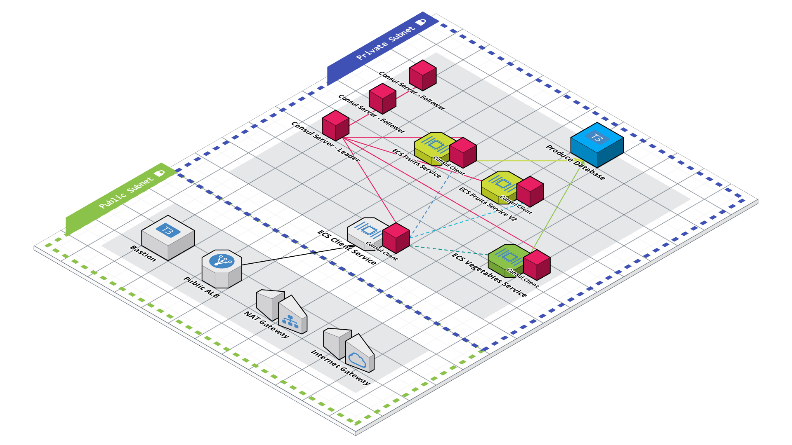

# Microservices Architecture on AWS

This is the working github repository for the [**"Learning Live with AWS & HashiCorp"**](https://www.youtube.com/playlist?list=PL81sUbsFNc5bYnjraNpivm1XxR3WNM_Kd) series. We'll discuss the foundations of a microservices architecture, the problem space it solves, where service mesh fits into all of this, and then begin from scratch - setting up a Terraform project, creating a Virtual Private Cloud (VPC), and explaining all of the concepts along the way.

This repo will be updated after each episode!

This repo is split into branches, each representing a part in the series:

- [Part 1](https://github.com/hashicorp/microservices-architecture-on-aws/tree/part-1) - Setting up the Terraform project and creating a VPC
- [Part 2](https://github.com/hashicorp/microservices-architecture-on-aws/tree/part-2) - Creating your first containerized microservice on Amazon ECS with Terraform
- [Part 3](https://github.com/hashicorp/microservices-architecture-on-aws/tree/part-3) - Extending your application with private microservices
- [Part 4](https://github.com/hashicorp/microservices-architecture-on-aws/tree/part-4) - Introducing a Service Mesh with Consul
- [Part 5](https://github.com/hashicorp/microservices-architecture-on-aws/tree/part-5) - Setting Up Your Service Mesh Servers
- [Part 6](https://github.com/hashicorp/microservices-architecture-on-aws/tree/part-6) - Connecting Amazon ECS Services to Consul Servers
- [Part-7 (this branch)](https://github.com/hashicorp/microservices-architecture-on-aws) - Collaboration and CI/CD on Amazon ECS with Terraform

## The Architecture

Our first section of episodes will work towards building out the following architecture:

The second section of episodes will work towards refactoring the first section's architecture into using a Service Mesh.

## Getting Started

#### Prerequisites

1. Have an [AWS Account](https://aws.amazon.com/).

2. Install [HashiCorp Terraform](https://www.terraform.io/downloads).

3. Have the [AWS CLI Installed](https://docs.aws.amazon.com/cli/latest/userguide/getting-started-install.html).

4. Create an [AWS IAM User](https://docs.aws.amazon.com/IAM/latest/UserGuide/getting-started_create-admin-group.html) with Admin or Power User Permissions.
  - this user will only be used locally

5. [Configure the AWS CLI](https://docs.aws.amazon.com/cli/latest/userguide/cli-chap-configure.html) with the IAM User from Step 4.
  - Terraform will read your credentials via the AWS CLI 
  - [Other Authentication Methods with AWS and Terraform](https://registry.terraform.io/providers/hashicorp/aws/latest/docs#authentication)

#### Using this Code Locally

1. Clone this repo to an empty directory.

2. Run `terraform plan` to see what resources will be created.

3. Run `terraform apply` to create the infrastructure on AWS!

4. Open your Consul Server's Load Balancer (output as `consul_server_endpoint`).

5. Run `bash scripts/post-apply.sh` and follow the instructions OR open your terraform statefile and copy your Consul Bootstrap Token.  Use this to Login to the Consul UI.
  - It may take a few moments for all of the services to come on line.

6. Click on **Services** in the side navigation.

7. Select our "Client" service and then click on the **Topology** tab.

8. Find the red arrow lines between the client service and the fruits / vegetables services.  Click on one of the red arrows to reveal a dialogue box that will ask if you'd like to create an intention.  Click **Create**.

9. Navigate to your Client Application Load Balancer (output as `client_alb_dns`) to confirm that everything is working.
  - It may take a few moments for the new intentions to be recognized.

10. Run `terraform destroy` when you're done to get rid of the infrastructure.

### Using this Code with Terraform Cloud

Part-7 of this series, which the `main` git branch is tied to, sets up our infrastructure on Terraform Cloud instead of running things locally.  You'll need to follow the below steps to get it up and running.

The below instructions point to generalized documentation and learn guides in the correct order.  For exact instructions using this code base, please see [Episode 7](https://hashi.co/learning-live-with-aws-and-hashicorp-ep-7) of the series where we cover it.

1. Fork this Repository.

2. [Signup for Terraform Cloud](https://hashi.co/ll-aws-hc-terraform-cloud)

3. [Setup your Terraform Cloud Account](https://learn.hashicorp.com/tutorials/terraform/cloud-sign-up?in=terraform/cloud-get-started)

4. [Connect Terraform Cloud to your AWS Account](https://learn.hashicorp.com/tutorials/terraform/cloud-create-variable-set?in=terraform/cloud-get-started)

5. [Create a Workspace in Terraform Cloud](https://learn.hashicorp.com/tutorials/terraform/cloud-workspace-create?in=terraform/cloud-get-started)

6. [Connect Your Forked Repository to Terraform Cloud](https://learn.hashicorp.com/tutorials/terraform/cloud-vcs-change?in=terraform/cloud-get-started)

7. [Set All Required Variables specified in `variables.tf`](https://www.terraform.io/cloud-docs/workspaces/variables)

8. [Trigger a Run to Plan and Apply Infrastructure](https://www.terraform.io/cloud-docs/run/manage)

### Managing the Consul Cluster with Terraform

As shown in [Episode 7](https://hashi.co/learning-live-with-aws-and-hashicorp-ep-7), we can also use Terraform to manage our live Consul Cluster deployed by this code.

The below instructions point to generalized documentation and learn guides in the correct order.  For exact instructions using this code base, please see [Episode 7](https://hashi.co/learning-live-with-aws-and-hashicorp-ep-7) of the series where we cover it.

1. Fork the [Consul Configuration Repo](https://github.com/hashicorp/microservices-architecture-on-aws-consul)

2. [Create a Workspace in Terraform Cloud](https://learn.hashicorp.com/tutorials/terraform/cloud-workspace-create?in=terraform/cloud-get-started)

3. [Connect Your Forked Repository to Terraform Cloud](https://learn.hashicorp.com/tutorials/terraform/cloud-vcs-change?in=terraform/cloud-get-started)

4. [Set All Required Variables specified in `variables.tf`](https://www.terraform.io/cloud-docs/workspaces/variables)
  - `tfc_organization` is the name of your Terraform Cloud Organization
  - `tfc_workspace_tag` is the tag you'd like to organize all of these related project under
  - `tfc_workspace` should be the name of the workspace that deployed the consul cluster
  - `consul_token` is the `consul_bootstrap_token` output from the workspace that deployed the consul cluster

5. [Set the AWS Credentials as Variables in this Workspace](https://learn.hashicorp.com/tutorials/terraform/cloud-create-variable-set?in=terraform/cloud-get-started)

6. [Trigger a Run to Plan and Apply Infrastructure](https://www.terraform.io/cloud-docs/run/manage)

### Guarding Your TFC Workspaces With [HashiCorp Sentinel](https://www.hashicorp.com/sentinel)

We can also insert an addition step between the `terraform plan` and `terraform apply` phases that checks our code, plan, statefile, and run data using [HashiCorp Sentinel](https://www.hashicorp.com/sentinel).

The below instructions point to generalized documentation and learn guides in the correct order.  For exact instructions using this code base, please see [Episode 7](https://hashi.co/learning-live-with-aws-and-hashicorp-ep-7) of the series where we cover it.

1. Fork the [Sentinel Policy Repo](https://github.com/hashicorp/microservices-architecture-on-aws-sentinel)

2. Head to **Settings** in your Terraform Cloud console

3. Click on **Policy Sets** in the side navigation bar

4. Click on **Connect a new policy set** in the **Policy Sets** screen

5. Follow the **Connect a Policy Set** step-by-step

6. Name the policy set whatever you'd like

7. Under the **Workspaces** area, select the specific workspaces you'd like this policy to guard.

8. Click **Connect policy set**

9. Optionally trigger a run in any of your workspaces to view the policy in action.

## Questions?  Suggestions?  Comments?

Reach out to either [Jenna Pederson](https://twitter.com/jennapederson) or [J. Cole Morrison](https://twitter.com/JColeMorrison).  Also, feel free to leave any issues you run into on this Github Repo!